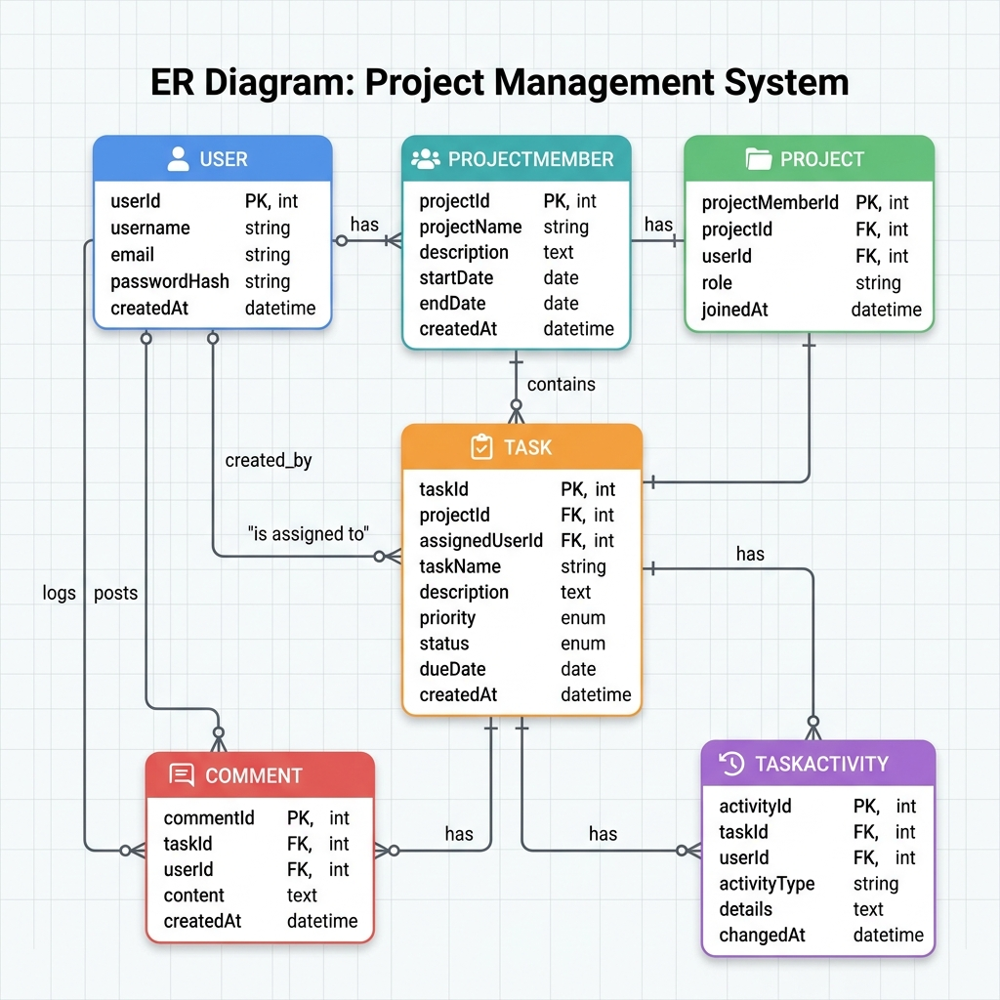

# Project Overview

**Project Name:** Vibecode (React + Express TypeScript Full‑Stack Example)

A modern full‑stack web application built with **React 19**, **Vite**, **TailwindCSS**, **Express**, **Prisma** (SQLite), and **TypeScript**. It demonstrates authentication, project and task management, and real‑time UI components.

---

## Tech Stack

- **Frontend**: React 19, Vite 6, TailwindCSS, Lucide‑React, Recharts, Motion
- **Backend**: Express 4, TypeScript, Prisma ORM (SQLite), JWT authentication
- **Utilities**: concurrently, dotenv, bcryptjs, jsonwebtoken
- **Package Manager**: npm (Node 22)
- **Development Tools**: tsx, eslint (via `npm run lint`), prettier, TailwindJIT

---

## Repository Structure

```
.
├─ src/                # React source code
│  ├─ components/     # UI components (TopBar, etc.)
│  ├─ context/        # React context (AppContext.tsx)
│  ├─ pages/          # Route pages
│  └─ api/            # API client wrappers
├─ server/            # Express server code
│  ├─ routes/          # API route definitions (authRoutes.ts, ...)
│  ├─ middleware/     # Auth middleware, error handling
│  └─ index.ts        # Server entry point
├─ prisma/            # Prisma schema & migrations
│  └─ schema.prisma
├─ public/            # Static assets
├─ vite.config.ts     # Vite configuration with API proxy
├─ package.json       # Scripts & dependencies
└─ README.md          # **You are reading it right now**
```

---

## Prerequisites

- **Node.js** ≥ 22 (recommended latest LTS)
- **npm** (comes with Node)
- **Git** (optional, for version control)

---

## Setup & Installation

1. **Clone the repository**
   ```bash
   git clone https://github.com/Nopphagaw-T/vibecode.git
   cd vibecode
   ```
2. **Install dependencies**
   ```bash
   npm install
   ```
3. **Configure environment variables**
   - Copy `.env.example` to `.env.local` (or create it).
   - Set `GEMINI_API_KEY` with your Gemini API key.
   - Ensure `PORT` values match (frontend: 3000, backend: 5000 by default).
4. **Prepare the database**
   ```bash
   npx prisma migrate dev --name init   # creates SQLite DB & schema
   npm run seed                       # optional seed data
   ```

---

## Development

Run both client and server concurrently:

```bash
npm run dev
```

- Frontend will be available at **http://localhost:3000**.
- Backend API runs on **http://localhost:5000** (proxy configured in `vite.config.ts`).
- Hot‑module replacement (HMR) is enabled unless the `DISABLE_HMR` env var is set.

### Useful Scripts

| Script | Description |
|--------|-------------|
| `npm run dev` | Starts frontend and backend together (via `concurrently`). |
| `npm run dev:frontend` | Starts only the Vite dev server. |
| `npm run dev:backend` | Starts only the Express server. |
| `npm run lint` | Runs TypeScript compile‑time check (`tsc --noEmit`). |
| `npm run build` | Builds the production bundle for the frontend. |
| `npm run preview` | Serves the built frontend locally. |
| `npm run seed` | Executes `prisma/seed.ts` to populate example data. |

---

## API Overview

All API routes are prefixed with `/api` and are proxied by Vite during development.

| Method | Endpoint | Description |
|--------|----------|-------------|
| `POST` | `/api/auth/register` | Register a new user (bcrypt password hashing). |
| `POST` | `/api/auth/login` | Authenticate and receive a JWT. |
| `GET` | `/api/auth/me` | Get current user profile (requires JWT). |
| `GET` | `/api/projects` | List projects belonging to the authenticated user. |
| `POST` | `/api/projects` | Create a new project. |
| `GET` | `/api/tasks` | Retrieve tasks (filterable). |
| `POST` | `/api/tasks` | Create a task. |
| `PUT` | `/api/tasks/:id` | Update a task (status, title, etc.). |
| `DELETE` | `/api/tasks/:id` | Delete a task. |
| ... | *(additional CRUD routes for comments, activities, etc.)* | |

The Swagger/OpenAPI spec is not included but can be generated with `express-openapi‑validator` if needed.

---

## Testing the API

A quick curl example to test login:

```bash
curl -X POST http://localhost:5000/api/auth/login \
  -H "Content-Type: application/json" \
  -d '{"email":"admin@example.com","password":"yourPassword"}'
```

You will receive a JWT token that can be used for subsequent authorized requests via the `Authorization: Bearer <token>` header.

---

## Production Build

1. Build the frontend:
   ```bash
   npm run build
   ```
2. Serve the built assets with a static server or integrate them into the Express app (modify `server/index.ts` to serve `dist`).
3. Ensure environment variables (`PORT`, `DATABASE_URL`, etc.) are set for the production environment.

---

## Troubleshooting

- **Port conflicts** – The backend defaults to port **5000**; if it’s in use, change `process.env.PORT` in `server/index.ts` and update the proxy target in `vite.config.ts`.
- **JWT errors** – Verify the JWT secret in `.env.local` matches the one used in `authRoutes.ts`.
- **TypeScript errors** – Run `npm run lint` to see compile‑time problems. Fix the reported interface mismatches in `src/context/AppContext.tsx` and `src/components/TopBar.tsx`.
- **PowerShell execution policy** – Use `cmd /c` to run npm scripts if PowerShell blocks unsigned scripts.

---

## License

This project is licensed under the **MIT License** – see the `LICENSE` file for details.

---

## Contributing

Feel free to open issues or submit pull requests. Follow the existing code style, run `npm run lint` before committing, and keep the README up‑to‑date.

---

**Happy coding!**

---

## Entity Relationship Diagram



